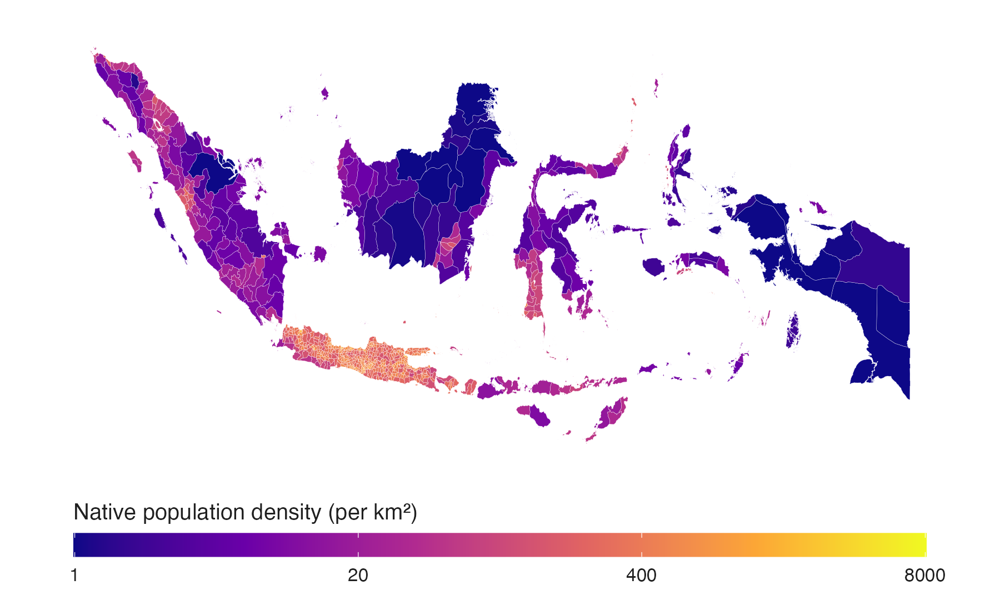

## Dutch East Indies Census and Administrative Boundaries, 1930

This repository contains a harmonized, lowest-level administrative-unit
dataset from the [1930 Dutch East Indies census](https://en.wikipedia.org/wiki/1930_Dutch_East_Indies_census)
(*Volkstelling 1930*), linked to a historical boundary layer. It covers 691
administrative units across the Netherlands East Indies.

The primary source is *Volkstelling 1930; Census of 1930 in Netherlands India*,
Table 1 (Batavia: Landsdrukkerij, 1933–1936). The original population tables
are available through [Leiden University Libraries](https://digitalcollections.universiteitleiden.nl/view/item/1085284).

Version 1.0 contains the harmonized census data, the historical shapefile, and
a high-resolution map of Native population density.

Initial public release, July 28, 2026.

<p align="center">
  
</p>

<p align="center"><em>Native population density in the Dutch East Indies by lowest-level administrative unit, 1930.</em></p>

## Citation

If you use this data, please cite:

```bibtex
@dataset{bounadi_2026_dutch_east_indies_census,
  title   = {Dutch East Indies Census and Administrative Boundaries, 1930},
  author  = {Bounadi, Monir},
  year    = {2026},
  version = {1.0}
}
```

## Data features

- Covers 691 lowest-level administrative units.
- Provides census population counts and a historical administrative hierarchy.
- Includes the historical census categories for Native, European, Chinese, and
  Other populations.
- Includes a project-created historical boundary layer, manually digitized in
  QGIS from georeferenced census maps in the *Grote Atlas van Nederlands
  Oost-Indië*.
- Includes an R script to recreate the Native population-density map.

## Data construction

The data combine transcriptions of Table 1 in the *Volkstelling 1930* volumes.
The Java and Madura component began with the `district_data.csv` file in the
replication materials for Thomas B. Pepinsky, [“Colonial Migration and the
Origins of Governance: Theory and Evidence From Java”](https://doi.org/10.1177/0010414015626442),
*Comparative Political Studies* 49(9) (2016): 1201–1237). The Sumatra and
remaining-island records are project transcriptions of the original census
tables. This release harmonizes names, administrative hierarchy, and stable
map identifiers across these components.

Values are retained as printed. A small number of original census rows are not
arithmetically additive; see `documentation/data-notes.md`.

The atlas map sheets were georeferenced in QGIS and their historical
administrative boundaries were manually digitized (on-screen traced). The
source maps are in *Grote Atlas van Nederlands Oost-Indië* (2003), pp. 70,
211–212, 343, 372, and 373. The GADM 4.0 Indonesia level-0 shapefile was used
as base geometry (downloaded 30 March 2022). The atlas is available through
the [National Archives of the Netherlands](https://www.nationaalarchief.nl/onderzoeken/archief/2.14.97).

Key measurement notes:

- `adm0`–`adm3` provide a standardized historical hierarchy. Colonial terms
  varied by region, so the original fields are retained alongside it.

  | Field | Meaning | Distinct units |
  |---|---|---:|
  | `adm0` | Broad island or census-region grouping | 3 |
  | `adm1` | Province, residency, or government | 22 |
  | `adm2` | Regency or division | 147 |
  | `adm3` | Lowest-level census unit: district or subdivision | 691 |

- Java and Madura use `province`–`regency`–`district`; Sumatra and the outer
  islands use `residency` or `government`–`division`–`subdivision`.
- `nativetotal` is the Native-category population count used in the map.
- `AREA_2` and `CODE_2` form the stable join key between the census file and
  the boundary layer.
- The population labels reproduce historical colonial census categories; they
  are not contemporary social classifications.

## Getting started

Download the repository and use the following files:

| File | Unit of observation | Observations |
|---|---|---:|
| `data/administrative_units.csv` | Lowest-level administrative unit | 691 |
| `data/spatial/map1930.*` | Polygon part | — |

The shapefile consists of its `.shp`, `.dbf`, `.shx`, and `.prj` companion
files. Join it to `administrative_units.csv` with `AREA_2` and `CODE_2`.

### Code examples

<details>
<summary>Python</summary>

```python
import geopandas as gpd
import pandas as pd

census = pd.read_csv("data/administrative_units.csv")
boundaries = gpd.read_file("data/spatial/map1930.shp")

data = boundaries.merge(
    census,
    on=["AREA_2", "CODE_2"],
    how="left",
    validate="many_to_one",
)
```

</details>

<details>
<summary>R</summary>

```r
library(sf)
library(dplyr)

census <- read.csv("data/administrative_units.csv")
boundaries <- st_read("data/spatial/map1930.shp", quiet = TRUE)

data <- left_join(boundaries, census, by = c("AREA_2", "CODE_2"))
```

</details>

<details>
<summary>Stata</summary>

```stata
import delimited "data/administrative_units.csv", clear varnames(1) encoding("utf-8")
isid AREA_2 CODE_2
tempfile census
save `census'

spshape2dta "data/spatial/map1930.shp", saving(map1930) replace
use map1930.dta, clear
merge m:1 AREA_2 CODE_2 using `census', keep(master match) nogen
```

</details>

Run `scripts/make_native_population_map.R` from the repository root to recreate
the map. Required packages: `sf`, `dplyr`, `ggplot2`, `viridis`, and `scales`.

## License

The tabular compilation, documentation, and code are released under [CC0 1.0](LICENSE).
Scientific citation is appreciated. The historical boundary layer is derived
from GADM base geometry and is excluded from the CC0 dedication. No unmodified
GADM data are included; consult the GADM terms before redistributing the
boundary layer. The base layer is available from GADM's [archived version 4.0
country page](https://gadm.org/download_country40.html).

## Version history

### Version 1.0

Initial public release, July 28, 2026.
